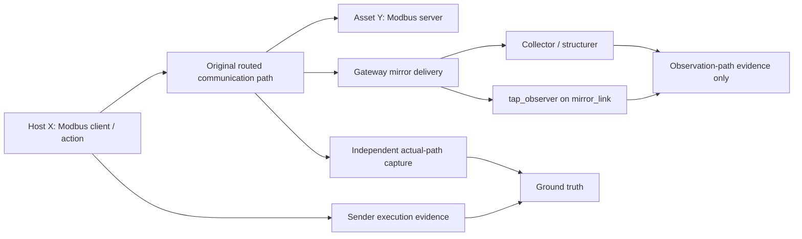

# C1 Modbus/TCP Step 1 — Range A Ground-Truth Pilot

**Study:** Study 01 — Negative Detection Result Reliability / Observability Validation  
**Candidate:** C1 — Modbus/TCP  
**Status:** Completed; see recorded C1 Step 1 evidence
**Planning basis:** [C1 source inspection](../analysis/candidate-evaluations/c1-modbus.md), [Candidate Validation Plan](./candidate-validation-plan.md)  
**Amenonuboco baseline:** `v0.12.0`, commit `78fc17746b5d663fafec9dffe563d79fe9ea02b7`

## 1. Purpose

This pilot determines only whether the C1 candidate can produce a repeatable, independently evidenced Modbus/TCP communication event in a baseline-compatible Range A.

It does **not** evaluate a detection rule, establish collector output, classify a Study 01 result, or select C1 as the final scenario. Those remain later steps.

## 2. Evidence Roles

The pilot must retain two independent evidence planes.



| Evidence role | Permitted source | Prohibited substitution |
| --- | --- | --- |
| Ground truth | Sender-side execution record **and** capture on a sender, receiver, or original routing-gateway interface carrying the unmirrored traffic | `tap_observer` on `mirror_link`, collector output, structured index, rule output |
| Observation-path evidence | `tap_observer` on `mirror_link`, sensor input, collector/structurer output | Treating any one of these as proof that the original communication occurred |
| Rule output | Rule/analytic output when Step 3 is executed | Ground truth or collector evidence |

`tap_observer` is useful in this pilot, but only as a later comparison point for mirror delivery. It is deliberately not independent from the fault class proposed for Range B.

## 3. Preconditions

Do not start the pilot until every item is recorded in the run metadata file.

- [ ] Unique run ID has been assigned.
- [ ] Kakuriyo commit is recorded.
- [ ] Amenonuboco checkout resolves exactly to `78fc17746b5d663fafec9dffe563d79fe9ea02b7`.
- [ ] The invoked manifest/generator/provisioning paths are recorded from that checkout.
- [ ] Host OS, Docker engine/Desktop, Docker Compose, and Python versions are observed and recorded.
- [ ] Images participating in the pilot have an image reference; available digests are captured.
- [ ] The selected sender-side Modbus operation and success predicate are written before execution.
- [ ] The independent original-path capture location and interface are identified before execution.
- [ ] The capture location is confirmed not to be `mirror_link` and not to depend on the evaluated collector/rule path.
- [ ] Output locations for sender evidence, independent capture, and optional mirror-side observation are prepared.

If any precondition is unknown, stop and record the candidate as blocked or unresolved. Do not substitute a later Amenonuboco `main` behavior for the fixed baseline.

## 4. Procedure

### 4.1 Prepare the fixed baseline

1. Resolve the Amenonuboco source used for the pilot to the exact baseline commit.
2. Record the exact source paths and commands used to generate/provision the water-utility candidate range.
3. Record the generated artifacts and the image inventory before producing candidate traffic.

The exact commands are execution evidence and must be copied into the run metadata or an attached command log when run. They are intentionally not prefilled here from memory.

### 4.2 Define the candidate event before traffic starts

Record one precise Modbus/TCP operation, including:

- candidate sender role and destination role;
- TCP destination port;
- Modbus function/register/value or read/write semantics;
- expected sender-side success condition;
- start and stop condition for the event.

The source-inspection candidate is a write/read operation between the water-utility Modbus client and PLC roles. This is a candidate only; the exact operation must be selected and recorded before this run.

### 4.3 Collect independent ground truth

1. Start the original-path capture at the predeclared interface on the sender, receiver, or routing gateway.
2. Start sender-side command/application logging.
3. Optionally start a `tap_observer` capture on `mirror_link`, but label it as observation-path evidence.
4. Execute the predeclared Modbus operation exactly once or according to the predeclared bounded repetition count.
5. Stop captures and preserve raw artifacts without overwriting them.

Do not accept simulated fallback output, an application process exit alone, or an Elasticsearch document as the ground-truth success condition.

### 4.4 Preserve and classify the pilot

Record the following separately:

| Artifact | Required classification |
| --- | --- |
| Sender command/application output | Ground truth — sender evidence |
| Original-path packet capture | Ground truth — independent capture |
| `tap_observer` capture, if collected | Observation-path evidence only |
| Collector/structured output, if collected | Observation-path evidence only; not required to pass Step 1 |
| Rule/alert output, if any | Do not interpret during Step 1; retain separately |

## 5. Step 1 Decision Rules

Use the following outcome vocabulary consistently in the run metadata and candidate analysis.

| Outcome | Meaning |
| --- | --- |
| Pass | Sender evidence and independent original-path capture confirm the same predeclared event. |
| Fail | Required ground-truth evidence is absent; the run does not satisfy the ground-truth criterion. |
| Unresolved | Available evidence conflicts or the capture placement/procedure requires investigation. |
| Invalid | A simulated fallback, unverified stand-in, or material procedure deviation makes the run unsuitable for evaluation. |

| Condition | C1 Step 1 decision |
| --- | --- |
| Sender evidence and independent actual-path capture confirm the same predeclared event | Pass — C1 may proceed to Step 2. |
| Sender evidence exists but independent capture does not confirm the event | Unresolved — investigate path/capture placement; do not proceed. |
| Independent capture exists but sender-side action is absent or ambiguous | Unresolved — do not infer ground truth. |
| Only `mirror_link`, collector, structured output, or rule evidence exists | Fail the ground-truth criterion — redesign capture placement. |
| Simulated fallback or unverified stand-in was used | Invalid pilot — do not use as Study evidence. |

## 6. Output Locations

Use one new run directory for each execution:

```text
evidence/candidate-evaluations/c1-modbus/run-<id>/
├── metadata.md
├── ground-truth/
│   ├── sender/
│   └── independent-capture/
├── sensor-input/
├── collector-output/
├── rule-output/
├── environment/
└── command-log/
```

Do not create fabricated artifacts to populate these folders. Add `.gitkeep` only when preserving an intentionally empty structural directory is useful.

## 7. Handoff to Step 2

If Step 1 passes, update [C1 source inspection and evaluation](../analysis/candidate-evaluations/c1-modbus.md) with the run identifier and paths to the real ground-truth artifacts. Then proceed to Step 2 using the same event semantics and preserve `tap_observer` as observation-path evidence rather than ground truth.

If Step 1 does not pass, preserve the failure record and update the C1 candidate worksheet as unresolved or rejected according to the recorded cause.

## 8. Recorded execution

Run [`c1-step1-20260823-001`](../evidence/candidate-evaluations/c1-modbus/run-c1-step1-20260823-001/metadata.md) passed the Ground Truth criterion. This procedure remains the historical C1-specific record; subsequent cross-candidate work is governed by the [Common Candidate Validation Procedure](./candidate-validation-common-procedure.md).
