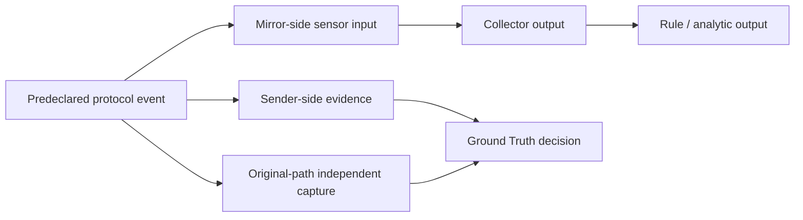

# Study 01 Candidate Validation — Common Evidence and Decision Procedure

**Study:** Study 01 — Negative Detection Result Reliability / Observability Validation  
**Status:** Pre-freeze common procedure  
**Applies to:** C1 Modbus/TCP and C2 DNP3  
**Related plan:** [Candidate Validation Plan](./candidate-validation-plan.md)

## 1. Purpose

This procedure fixes the **meaning of candidate validation**, rather than requiring identical protocol commands. C1 and C2 may use different service implementations, packet fields, and sender commands, but must satisfy the same evidence requirements and decision logic.

```text
same evidence requirements + same decision rules
    ≠ identical protocol-specific commands
```

It prevents the final candidate comparison from conflating protocol behavior with a different measurement method.

## 2. Common evidence model

Every candidate validation run preserves these stages separately:



| Stage | Common requirement | Explicitly not accepted as a substitute |
| --- | --- | --- |
| Predeclaration | Identify Host X, Asset Y, protocol operation, bounded repetition, sender success predicate, capture placement/filter, and expected artifact before traffic. | Inferring the event only after inspecting a packet or log. |
| Ground Truth | Sender-side evidence **and** a capture at sender, receiver, or original routing path before mirror delivery. | `mirror_link`, sensor, collector, structured event, or alert alone. |
| Sensor input | A raw or otherwise preserved sensor-interface artifact identifies the same event. | Collector output or alert as evidence that the sensor received the traffic. |
| Collector output | A preserved query/response or exported artifact identifies the event from the collector/structuring path. | A container-health assertion or an unpreserved visual observation. |
| Rule output | A preserved alert or explicit no-alert result with the rule identifier and input/output conditions. | Treating collector presence as rule execution. |

## 3. Common execution sequence

### Step 0 — Source inventory

At the pinned Amenonuboco baseline, record manifest, topology, traffic source, mirror/sensor path, collector path, rule/analytic path, and static-validation extension points. Source inspection does not establish runtime behavior.

### Step 1 — Ground Truth pilot

1. Create and commit a result-free run registration.
2. Record environment/image identifiers and protocol-specific event semantics before the trigger.
3. Start original-path capture and sender logging.
4. Execute the bounded, predeclared operation.
5. Preserve the sender record and pcap; calculate a SHA-256 digest for raw packet evidence.
6. Correlate sender and pcap evidence, then record `Pass`, `Fail`, `Unresolved`, or `Invalid`.

The mirror path is always excluded from Ground Truth because a future Range B mirror-path fault must not also destroy the source of Ground Truth.

### Step 2 — Observation-chain pilot

Using the same event semantics as Step 1:

1. Preserve Ground Truth again; do not merely cite the earlier run.
2. Capture sensor input at the specified mirror/sensor interface.
3. Preserve a collector query and raw response using fields observed from that collector's actual schema.
4. Record independent decisions for Ground Truth, sensor input, and collector output.
5. Do not interpret rule output in this step.

### Step 3 — Rule/analytic feasibility and positive control

Record the rule or analytic identifier, source/loading path, input preconditions, output location, and positive-control result. Determine whether the normal event yields an alert or a recorded no-alert result; neither is yet a Study 01 result.

### Step 4 — Range B fault feasibility

Propose and probe one isolated observation-path fault while preserving the same event, Ground Truth, and protocol semantics. The fault may not be a trivial collector/parser/Elasticsearch service outage.

### Step 5 — Range C static correspondence

Describe the same semantic observation contradiction as a non-provisioned manifest-level negative case. Record the promised property, expected validator decision, and whether it requires a generic Amenonuboco capability.

### Step 6 — Candidate decision

Classify each candidate using the definitions in the Candidate Validation Plan: `Eligible`, `Eligible with K4 dependency`, `Deferred`, or `Rejected`.

## 4. Common decision vocabulary

| Outcome | Meaning |
| --- | --- |
| Pass | The stage's required preserved evidence confirms the predeclared condition. |
| Fail | Required evidence is absent under the declared procedure. |
| Unresolved | Evidence conflicts, is ambiguous, or procedure/capture placement requires investigation. |
| Invalid | A simulated fallback, unverified stand-in, or material procedure deviation makes the run unsuitable for evaluation. |

An outcome at one stage must not be silently propagated to another. For example, collector `Pass` does not prove Ground Truth, and Ground Truth `Pass` does not prove rule execution.

## 5. Common per-run record

Every run must include:

- candidate/run IDs and Kakuriyo commit;
- pinned Amenonuboco release/commit and any worktree identity;
- predeclared Host X, Asset Y, operation, sender predicate, capture locations, and filters;
- observed Docker, Compose, Python, image identifiers/digests, start/end timestamps, and deviations;
- raw pcap hashes where captures are used;
- sender, Ground Truth, sensor, collector, and rule artifacts in distinct paths;
- an explicit decision for each stage evaluated, with unmeasured stages marked `Not evaluated`.

## 6. C1 adoption note

C1 Step 1 (`c1-step1-20260823-001`) and Step 2 (`c1-step2-20260823-001`) were executed before this common-procedure document was committed. They are not retroactively presented as pre-registered under this document. Their recorded evidence is nevertheless mapped to the same requirements above:

| C1 run | Common stages evidenced | Remaining stages |
| --- | --- | --- |
| `c1-step1-20260823-001` | Step 1 Ground Truth | Sensor, collector, rule, fault, static correspondence |
| `c1-step2-20260823-001` | Step 1 Ground Truth; Step 2 sensor input and collector output | Rule, fault, static correspondence |

This document governs all subsequent candidate-validation work, including C2, and provides the comparison frame for the final C1/C2 decision. If a later C1 rerun is needed, it MUST follow this procedure directly.
