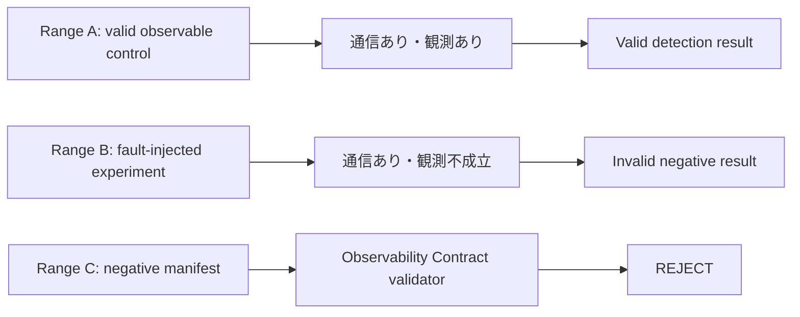

# Study 01：Cyber Range実験におけるNegative Result信頼性検証

**状態:** Active protocol（Project Kakuriyoの正本）  
**親研究:** CRaC Evaluation Plan v0.1  
**発表主題:** 「検知されなかった」は信頼できるか  
**成果物:** JSAC CFPを支える再現可能なRange A/B実証、Range Cの負のmanifest検証、検知評価手順、発表証拠一式

> **移管済み:** 本文書はStudy 01の研究protocol・文献調査・JSAC成果物の正本である。旧Amenonuboco Phase 14は移管元・履歴としてのみ保持する。責任境界と移管対応表は[Project Kakuriyo 独立化計画](../../../docs/independence-plan.md)を参照。

---

## 1. 背景と位置づけ

Amenonubocoの旧Phase 0〜13は、宣言的manifestからOT/ICS Cyber Rangeを生成し、計装、構造化、観測境界を扱える状態を作ってきた。Study 01は、その機能を広く紹介する開発Phaseではない。

本Studyが扱う問いは、Cyber RangeでIDS rule、SIEM rule、EDR analytic、Purple Team exerciseなどを評価し、「検知されなかった」というnegative resultを得たとき、その結果を検知・分析対象の失敗として結論してよいのか、である。通信や攻撃的操作が存在しても、mirror、gateway、sensor、collector、parser、structured outputの経路が成立していなければ、検知器へ評価対象の入力が届かない。

その場合に評価しているのは検知ruleではなく、壊れた実験環境である。したがって本Studyの対象は、単なる未検知でも分析者個人の誤りでもなく、**観測不備がCyber Range実験のnegative resultを無効化する問題**である。

> **「アラートが出なかった」を信用する前に、「アラートを出せる観測環境だった」ことを証明しなければならない。**

本Studyでは、この実験品質上の問題を単なる運用上の注意事項として扱わない。Cyber Rangeに暗黙的に存在する「この通信は評価対象のsensorで観測可能である」という前提を、宣言・検証可能な実験条件、すなわち**Observability Contract**として表現できるかを評価する。これにより、Cyber Range as Code（CRaC）がTopologyだけでなく、実験結果を信用するために成立すべき観測条件まで記述・検証するという設計原則の一部を実証する。

CRaC評価全体は親研究として継続する。Study 01はそのうち、JSACの分析者・インシデント対応者へ直接還元できる部分を小さく独立させる。

---

## 2. 先行研究の初回調査（2026-08-23）

### 2.1 調査範囲と現時点の結論

初回調査では、Cyber Range／ICS security testbedの再現性・信頼性、IDS評価、telemetry／observability、security testbed validationを対象に、査読論文・公開学術資料を探索した。これは**新規性を確定するための体系的レビューではなく、Stage S1-0をfreezeする前の探索的スクリーニング**である。

結論は二つある。

1. testbedの信頼性、measurement accuracy、monitoring/logging、repeatability/reproducibilityを重視する既存研究は確認できた。したがって「観測を確認して初めて実験結果を信頼できる」という問題意識自体を新規と主張してはならない。
2. scenario-level observability、部分的telemetry欠落、Telemetry Coverage Indexを扱う近接研究も確認した。Observability Contractとの差分、特に「negative detection resultの成立条件を宣言的manifestへ記述し、静的rejectとruntime確認を分けて検証する」点が既存研究にないかは、全文確認前には断定できない。

### 2.2 確認した主要文献とStudy 01への含意

| 文献 | 初回確認できた範囲 | Study 01への含意 |
| --- | --- | --- |
| Ani et al. (2021), *Design Considerations for Building Credible Security Testbeds* | ICS security testbedのcredibilityを、設計目的、architecture、repeatability、measurability、monitoring/logging、evaluation processを含む設計要因として扱う。 | 本研究はcredibility／measurement accuracyの既存議論を継承する。Observability Contractをそれらの代替概念としては主張しない。 |
| Siaterlis et al. (2013), *EPIC* | 科学的に厳密なCPS security experimentationのため、measurement accuracy、repeatability、実験プロセスとcontrol/monitoring processの分離を重視する。 | ground truth、sensor入力、collector出力、rule出力を分離する設計は、この測定・監視の分離と整合する。 |
| Tarman et al. (2021), *Comparing reproduced cyber experimentation studies across different emulation testbeds* | 実験成果物・環境・測定を含む再現研究と、testbed間の結果比較を扱う。 | Git tag、image digest、evidence、clean rerunを残すStage S1-7の根拠になる。 |
| Göhring et al. (2022), *SOCBED* | IDS等に用いるログ／network artifactを、sound・controlled・reproducibleに生成するtestbedを提示する。 | artifact公開・再現性は既知の実践であり、Study 01の再現キットはこの流れに位置付ける。 |
| Chmielewski (2026), *Detection Latency in Container-based Cyber Ranges* | container rangeでscenario-level observabilityと部分的telemetry欠落を扱い、Telemetry Coverage Indexを提示する近接研究。公開abstractは確認済みだが、本文は未入手。 | 最重要の比較対象候補。全文を確認し、観測coverageの定義、negative detection resultの扱い、宣言的仕様、deployment前validation、runtime validationを個別に対照するまで差分を主張しない。 |

初回調査で参照した公開資料：

- Ani et al., [*Design Considerations for Building Credible Security Testbeds: Perspectives from Industrial Control System Use Cases* (2021)](https://discovery.ucl.ac.uk/id/eprint/10118058/)
- Siaterlis et al., [*EPIC: A Testbed for Scientifically Rigorous Cyber-Physical Security Experimentation* (2013)](https://publications.jrc.ec.europa.eu/repository/handle/JRC80927)
- Tarman et al., [*Comparing reproduced cyber experimentation studies across different emulation testbeds* (2021)](https://cset21.isi.edu/papers/cset21-7.pdf)
- [*SOCBED: Reproducible and Adaptable Log Data Generation for Sound Cybersecurity Experiments*](https://publica.fraunhofer.de/entities/publication/ec8a756a-cd78-4efd-86fb-071bd7b97a85)
- Chmielewski, [*Detection Latency in Container-based Cyber Ranges* (2026)](https://ibima.org/accepted-paper/detection-latency-in-container-based-cyber-ranges/)

Chmielewski (2026) は、47th IBIMA Computer Science Conference（2026-06-29–30、Madrid）のaccepted paperであり、会議ページにはISBN `979-8-9945104-1-4`、ISSN `2767-9640`、Proceedingsの参加者向け提供、各paperへのDOI付与方針が記載されている。2026-08-23時点で個別本文PDFおよび検索可能な個別DOIは確認できないため、本文未入手として扱う。著者・会議・Proceedings・入手経路候補の詳細は、[`jsac/literature-gap-matrix.md`](../../../literature/gap-analysis.md) §5.1および[`jsac/Phase14-Literature-Chmielewski-2026.md`](../../../literature/chmielewski-2026.md)を正本とする。

### 2.3 現時点の主張境界

本Studyは、次のいずれも現段階では主張しない。

- Cyber Rangeの監視・ログ・measurement accuracyを最初に扱う研究であること。
- telemetry欠落や部分的observabilityを最初に定量化する研究であること。
- Observability Contractという名称または類似するcontract／assuranceの考え方が既存研究に存在しないこと。

先行研究精査後に主張可能性が残る候補は、次の限定された組合せである。

> Cyber Range上の**negative detection resultを有効とみなす前提条件**を、ground truth・sensor入力・collector出力・rule出力の連鎖として事前定義し、同じ観測矛盾について、(a) 故障注入Rangeで実験結果をInvalid negative resultとして実証し、(b) 宣言的manifestでdeployment前rejectを試験し、(c) 再現キットとして公開する。

この候補も、先行研究との差分表を完成するまで「新規性」とは記述しない。必要なら、発表は既存研究のcredibility／measurement accuracyをOT/ICS Cyber Rangeの検知評価へ具体化する実践的な検証として位置付ける。

---

## 3. 研究課題と仮説

### RQ-J1

ground-truth network eventが実在し、検知結果が「alertなし」である場合、事前定義した評価手順は、検知ruleの有効なnegative resultと観測coverage不成立による無効な実験結果を正しく区別できるか。

### RQ-J2

評価対象の通信、sensor、collector、期待するeventをObservability Contractとして宣言することで、指定した観測矛盾をdeployment前に検出またはrejectできるか。

> **C2選定後の詳細正本:** C2 DNP3のevent、Range A/B/C、static/runtime invariants、採点、K4受入条件、sender、image inventory、derivation/cleanupは、[Scenario Selection Record](./scenario-selection.md)、[C2 Scenario Draft](./c2-dnp3-scenario-draft.md)、[Freeze Decision Table](./freeze-decision-table.md)、[Canonical Sender Procedure](./c2-dnp3-sender-procedure.md)、[C2 Image Inventory](./c2-dnp3-image-inventory.md)、[C2 Range Derivation and Cleanup](./c2-dnp3-range-derivation.md)を正本とする。本文書の一般原則はそれらのC2固有条件を上書きしない。

### 仮説

- **H-J1:** Range Bではground-truth network eventが通信実在を示し、対象ruleはalertなしでも、対象sensorへの観測coverageが不成立であるため、このnegative resultは検知性能を支持しない。
- **H-J2:** Range Aでは同一のground-truth network eventに対し、対象sensorのpacket/event到達とcollector出力を確認できるため、対象ruleのalertあり／なしを有効な検知評価結果として扱える。
- **H-J3:** 定義済みの観測矛盾は、Amenonubocoのvalidatorでdeployment前にrejectされる。
- **H-J4:** 事前定義した評価手順は、Range Bの「alertなし」を検知失敗と分類せず、Observability Contract不成立による**Invalid negative result**と分類する。

H-J1〜H-J4のいずれかが支持されなかった場合も、結果を保持し、CFP・スライドの主張を結果に合わせて縮小する。

---

## 4. 実験範囲

### 4.1 Range A：観測可能な対照

- 対象通信経路が存在する。
- 対象通信が送信側証跡と独立packet captureで確認できる。
- manifestで宣言したcollector pathが構造的・runtime上ともに有効である。
- 対象sensorへpacketが到達し、期待するprotocol eventとstructured outputが生成される。
- positive control ruleまたは同等の観測確認により、評価対象の入力が検知経路へ届くことを確認する。
- この条件を満たした場合に限り、対象ruleのalertあり／なしを有効な検知評価結果として扱う。

### 4.2 Range B：故障注入した実験用Range

- Range Aと同じ通信要件および同じ意味上の通信を用いる。
- 対象通信経路は実在し、ground truthで確認する。
- 観測経路に一つだけ、意図的・隔離的・安全な不備を置く。
- 故障点は、全container、collector、Elasticsearch、parserが稼働して別segmentのイベントも通常どおり流れる状態を保った、対象segmentのmirror配送またはgateway経由性とする。
- collector containerの停止、Elasticsearch停止、parser停止のように、ログ不在の原因が直ちに分かる故障は採用しない。
- 対象ruleはalertなしとなるが、対象sensorのpacket到達、期待event、collector出力のいずれかが欠けるため、検知性能のnegative resultを支持できない状態にする。

Range Bは実環境の脆弱性実証ではない。攻撃通信を不正に外部へ送出せず、実験用Docker環境に閉じる。

Range Bは、H-J1およびH-J4を検証するために**実際にprovisionして実行する**。したがって、Range B自体をdeployment前にrejectする対象にはしない。

### 4.3 Range C：Observability Contract違反の負のmanifest

- Range Bで注入した観測不備と意味的に同じ矛盾を、manifest上の宣言矛盾として表現する。
- `observable=true`であるにもかかわらず、必要なgateway attachment、mirror target、collector destinationのいずれかが成立しない状態を作る。
- Range Cはprovisionしない。`validate`が原因・対象・修正方向を含むObservability Contract violationとしてrejectすることを確認する。
- Range Cの役割は、H-J1/H-J4ではなく、RQ-J2およびH-J3に対するdeployment前予防の検証である。

### 4.4 検知評価結果の分類

| 分類 | 判定 |
|---|---|
| Valid detection result | ground truth、対象sensorへの到達、collector出力、Observability Contractが確認済みであり、対象ruleのalertあり／なしを検知評価結果として扱える。 |
| Invalid negative result | ground truthは存在し、alertなしでも、Observability Contractが無効・未検証・不明であるため、対象ruleの検知失敗を結論できない。 |
| Inconclusive experiment | ground truth、観測coverage、検知出力のいずれかが欠け、実験結果そのものを判定できない。 |

Range Bでground truthが通信実在を示しても、Observability Contractが不成立なら、alertなしを「検知できなかった」と結論することは誤分類である。

---

## 5. 実施作業

### Stage S1-0：プロトコル凍結

- [x] C2 DNP3の対象protocol、Host X、asset Y、ground-truth network event、およびRange Cのsegment-level observation contradictionを、[Scenario Selection Record](./scenario-selection.md)と[Freeze Decision Table](./freeze-decision-table.md)に記録する。これらの正本を本文書で複製しない。
- [x] Range Bのsource-segment ingress mirror faultと、Range Cの同じsegment-level observation precondition/blind spotを対応付ける。Range Cはconcrete DNP3 eventを静的検証するものではない。
- [ ] 実装・Range B投入・結果観測より前に、Invariant Specificationを独立文書として凍結する。
- [ ] Observability Contractのstatic/runtime invariantとK4 acceptance semanticsを、[Invariant Specification Draft](./invariant-specification.md)および[Freeze Decision Table](./freeze-decision-table.md)のレビュー済み状態として凍結する。
- [ ] invariantが対象外とする観測不備も明記する。
- [ ] ground truth、対象sensor入力、collector出力、対象rule出力、検知評価結果の三分類を[Scoring Draft](./scoring.md)として、multi-hit・T0 guard・15秒operational boundを含めて凍結する。
- [ ] sender script canonical path/invocation/record format、image inventory、Range A/B/C derivation/cleanupを確定し、[Evidence Schema Draft](./evidence-schema.md)とともに凍結する。
- [ ] 実験開始commitと環境情報を記録する。

### Stage S1-0.1：先行研究の精査と差分表の確定

初回スクリーニングで見つかった近接研究を全文確認し、Observability Contractの主張範囲を実験開始前に固定する。文献探索を無制限に続けるのではなく、CFPの主張境界を決めるためのゲートとして実施する。

- [ ] [`jsac/literature-gap-matrix.md`](../../../literature/gap-analysis.md) をStage S1-0.1の正本として作成・更新する。各判定は根拠ページ／節と確度を伴わなければならない。
- [ ] Ani et al. (2021)、Siaterlis et al. (2013)、Tarman et al. (2021)、SOCBED、Chmielewski (2026)を全文または著者公開版で確認する。
- [ ] 各文献について、対象testbed、検知評価、ground truth、telemetry/coverage定義、静的仕様、runtime検証、deployment前validation、negative resultの扱い、再現資産の各列を持つ差分表を作る。
- [ ] Chmielewski (2026)のTelemetry Coverage Indexと本StudyのObservability Contractについて、対象範囲・測定単位・故障注入・検知結果の意味付け・implementation validationを明示的に比較する。
- [ ] 「新規性」ではなく「既存研究をどう具体化・拡張・組み合わせるか」の根拠を、引用箇所とともに記録する。
- [ ] 先行研究が同じ組合せを既に実証していた場合は、RQ、CFP、発表タイトルを縮小または差し替える。
- [ ] 差分表、引用候補、CFPで使用する主張文を同一commitで固定しない限り、Stage S1-0をfreezeしない。

### Stage S1-0.5：Invariant Specificationの事前凍結

Range Bを見てから都合のよいvalidatorを追加した、という疑いを避けるため、不変条件は故障注入・結果観測より前に固定する。

1. 観測可能と宣言するsegmentの意味を定義する。
2. 次の静的条件とruntime条件を、別の不変条件群として定義する。

| 区分 | 事前凍結する不変条件 | 判定対象 |
| --- | --- | --- |
| Static invariants | gateway attachmentが存在する | manifest・生成されたtopology |
| Static invariants | mirror targetが宣言されている | instrumentation宣言・生成成果物 |
| Static invariants | collector destinationが定義されている | collector設定・service接続定義 |
| Runtime invariants | mirror trafficが実際に到達する | capture、RX統計、対象interface |
| Runtime invariants | collector port/interfaceが期待するtrafficを受信する | collector側capture・runtime統計 |
| Runtime invariants | structured outputが生成される | protocol event・structured index・保存結果 |

3. 各必要条件をどの静的情報またはruntime確認で判定するか決める。
4. valid controlとnegative caseを定義する。
5. Invariant Specification、Range A/B/C仕様、validator採点基準を同一freeze commitで記録する。
6. その後にvalidatorを実装し、positive/negative testを通してからRange Bを投入する。

validatorが表現できない不備は、事後に黙って規則を追加しない。未対応範囲として記録するか、プロトコル改訂として理由・影響・再実行対象を明記する。

> **設計原則：configuration correctness ≠ observation correctness**  
> 静的な構成が正しく見えても、runtimeでmirror配送、collector受信、構造化出力が成立するとは限らない。したがって、deployment前にrejectできる静的矛盾と、実行後に実証すべき観測成立を混同しない。

### Stage S1-1：Range Aの構築と基準取得

- [ ] manifestからRange Aをprovisionする。
- [ ] ground-truth network eventを実行する。
- [ ] 送信側実行証跡、対象通信経路上の独立packet capture、collector側packet/log、structured outputを保存する。
- [ ] collector pathの構造・runtime有効性を検証する。
- [ ] 評価手順がRange Aの対象rule結果をValid detection resultとして返すことを確認する。

### Stage S1-2：Range Bの構築とground truth確認

- [ ] Range Aとの差分を観測不備一件だけに限定する。
- [ ] 対象通信経路のground truthがRange Aと同様に存在することを確認する。
- [ ] 対象sensor入力、collector出力、対象rule出力のうち何が見え、何が見えないかを記録する。
- [ ] 不備が通信不発、単なるcontainer停止、または対象rule以外の故障と混同されないよう切り分ける。
- [ ] 評価手順がRange BをInvalid negative resultとして返すことを確認する。

### Stage S1-3：Range Cと観測invariantの負の制約試験

- [ ] Range Bと意味的に対応する観測矛盾をRange Cのmanifest上で表現する。
- [ ] Range Cがprovision前の`validate`対象であり、実行用Range Bと混同されないことを確認する。
- [ ] validatorがdeployment前にrejectする不変条件を実装または既存実装と照合する。
- [ ] errorが原因・対象・修正方向を示すか確認する。
- [ ] valid control manifestがfalse rejectionされないことを確認する。
- [ ] rejectできない矛盾は、未対応範囲として明記する。

### Stage S1-4：検知評価手順と採点器

- [ ] 評価に使うground truth、sensor入力、collector出力、rule出力を事前定義する。
- [ ] ground truthを対象ruleの評価入力から分離する。
- [ ] detection resultとObservability Contract判定を別フィールドで出す採点器を実装する。
- [ ] すべての判定を生ログ、capture、validator結果まで遡れるようにする。
- [ ] Range A/Bの結果を同じ形式の検知評価表へ正規化する。

### Stage S1-5：UG/CG副次評価（Core Completion後のみ）

本StageはStudy 01 Core Completion、すなわちRange A、故障注入Range B、Range Cの負の制約試験、検知評価手順、再現キットの必須条件を完了した後にのみ着手する。Range A/B実証を置き換えない。時間・実装余力が不足する場合は、UG/CGを延期する。

- [ ] 同じ意味仕様を使う小規模T1またはT3 taskを一つ固定する。
- [ ] UGとCGのprompt、許可ツール、修復feedback、停止規則を凍結する。
- [ ] semantic/observability defectとrepair effortを記録する。
- [ ] 結果を「生成比較の補助証拠」としてのみ扱う。

### Stage S1-6：再現・発表証拠化

- [ ] clean environmentからRange A/Bを再実行し、Range Cは`validate`を再実行する。
- [ ] 環境差、image cache、runtime差を記録する。
- [ ] ground truth、sensor入力、collector出力、rule出力、validator出力、結果表を保存する。
- [ ] JSAC-CFP、想定Q&A、スライド構成を実測結果へ同期する。
- [ ] ライブデモを必須にせず、保存済み証拠だけで説明可能にする。

### Stage S1-7：再現キットの公開準備と版固定

CFPの「第三者が研究結果を再現・改変できる」という約束を、公開可能な成果物と受入基準へ落とし込む。Range Bは故障注入を実行して分析推論を検証する環境、Range Cは観測不変条件違反を示すnegative manifestとして扱う。

- [ ] `examples/jsac-observability/` に、`range-a.yaml`、`range-b.yaml`、`range-negative.yaml`、`traffic/`、`expected/`、`evidence/`、`README.md`を配置する。
- [ ] READMEに、前提条件、起動・検証コマンド、期待結果、ground truth・sensor入力・collector出力・rule出力の区別、終了・クリーンアップ手順を記載する。
- [ ] clean environmentで、Range Aはprovision後に有効な検知評価条件を生成し、Range Bは故障注入後にInvalid negative resultの条件を再現し、Range Cは`validate`で原因・対象・修正方向を含む不変条件違反としてrejectされることを確認する。
- [ ] evidenceに含まれるpacket capture、ログ、manifest、image参照を点検し、認証情報、秘密情報、不要な個人情報、意図しない外部IP・ホスト名を公開対象から除外する。
- [ ] 公開物のライセンス、第三者素材の再配布可否、利用上の安全上の注意を確認する。
- [ ] CFP、スライド、README、evidenceが参照するGit tag/commit、container image digest、実行環境情報を固定して記録する。
- [ ] 発表時点の再現キットが、CFPの公開予定情報および主張境界と矛盾しないことを確認する。

---

## 6. 証拠の対応表

| 主張 | 必要な一次証拠 | 反証・注意点 |
|---|---|---|
| ground-truth network eventが実在した | 送信側実行証跡、対象通信経路上の独立capture | collector側ログだけをground truthにしない。 |
| Range Aは有効な検知評価環境 | sensor capture、flow/protocol log、structured output、positive control、coverage検証 | 単一ログ種別だけで判定しない。 |
| Range Bはnegative resultを無効化する観測不備 | A/B差分、sensor/collector path検証、rule出力 | 通信不発やサービス停止を除外する。 |
| alertなしを検知失敗と結論できない | 事前定義した検知評価手順とObservability Contract判定 | 「アラートがない」だけでは不十分。 |
| invariantが予防した | Range Cのdeployment前reject、error、valid control | 対応範囲外の不備まで防ぐと主張しない。 |

---

## 7. 終了条件

Study 01は、次の全条件を満たしたとき完了とする。

- [ ] Range Aで、ground truth、対象sensor入力、collector出力が成立し、対象ruleの結果をValid detection resultとして扱える。
- [ ] Range Bで、ground truthは通信実在を示す一方、Observability Contract不成立のためalertなしを検知失敗として結論できない。
- [ ] 評価手順がRange BをInvalid negative resultと分類する。
- [ ] Range Cで、指定した観測矛盾についてdeployment前rejectまたは未対応範囲の明確な記録がある。
- [ ] Stage S1-0.1の差分表を完了し、先行研究に照らした主張境界と引用候補を固定した。
- [ ] Range A/Bの差分、Range Cの負のmanifest、不変条件、環境、入力、ログ、capture、結果表を保存した。
- [ ] clean environmentで少なくとも一回の再実行または再現不能理由を記録した。
- [ ] `examples/jsac-observability/` の再現キットをclean environmentで検証し、Range Aの有効な検知評価、Range BのInvalid negative result、Range Cの事前rejectを確認した。
- [ ] 公開対象の安全・秘匿点検、ライセンス確認、Git tag/commit・image digest・環境情報の版固定を完了した。
- [ ] CFP、Q&A、スライド案が実測結果と主張境界へ同期している。

UG/CG副次評価は、実施した場合のみ結果に含める。未実施でも上記の検知評価・Observability Contract実証が完了していれば、Study 01のJSAC最小成果は達成とする。

---

## 8. 非目標とリスク

### 非目標

- 全OT/ICSトポロジーにおける通信不在の証明
- すべての分析者誤りの排除
- すべてのtelemetry不在を構成不備と断定すること
- Amenonubocoの全機能をJSACで紹介すること
- UG/CG結果を全AIモデルや手作業構築へ一般化すること

### 主なリスクと対処

| リスク | 対処 |
|---|---|
| Range Bで通信自体が失敗する | 送信側証跡と対象通信経路のcaptureを先に確認し、失敗ならnegative resultの信頼性実験として採用しない。 |
| Range Cの矛盾をvalidatorがまだ表現できない | 未対応を明記し、事前rejectの主張から外す。必要ならinvariant実装を独立作業として記録する。 |
| ライブデモが不安定 | 保存済みの証拠・capture・結果表を主証拠にし、デモは任意にする。 |
| UG/CG評価が大規模化する | Study 01の必須成果から切り離し、T1/T3の一taskに限定するか延期する。 |
| 結果が仮説を支持しない | 結果を保持し、CFPの主張を縮小・修正する。 |

---

## 9. 成果物

- Range A/Bのmanifest、差分、実行手順、およびRange Cの負のmanifest
- `examples/jsac-observability/` の再現キット（Range A/B、Range Cのnegative manifest、traffic、expected、evidence、README）
- ground-truth network eventと独立packet capture
- 対象sensor入力、collector出力、rule出力の評価セット
- Observability Contract validatorと負の制約テスト
- 機械可読な検知評価結果・不変条件結果
- A/B比較表、再現記録、環境記録
- 公開版を特定するGit tag/commit、container image digest、ライセンス・安全点検記録
- 実測に同期したJSAC-CFP、Q&A、Slide Deck

Study 01の発表上の結論は、結果が支持する場合に限り次の一文へ収束させる。

> **「検知されなかった」を結論する前に、評価対象の検知器が対象通信を観測できる環境だったことを検証しなければならない。**
