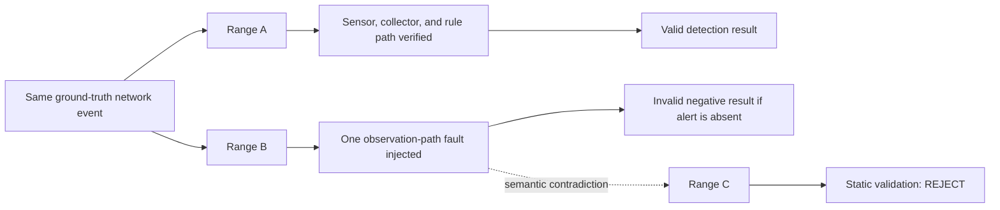

# Study 01 Scenario Selection Record

**Study:** Study 01 — Negative Detection Result Reliability / Observability Validation  
**Status:** Pre-freeze preparation — C2 selected contingent on the K4 generic-capability dependency
**Related records:** [Experiment Protocol](./experiment-protocol.md), [Dependency Freeze Record](./dependencies.md)  
**Decision authority:** The selected scenario becomes authoritative only when it is recorded here and included in the K3 Protocol Freeze commit.

## 1. Purpose

This record makes the selection of the Study 01 scenario reviewable before Range A/B/C are implemented. It prevents a protocol, fault condition, or rule from being chosen after observing experimental results.

The final selection must define one coherent chain:

```text
Host X → Asset Y → Ground-truth network event
       → Sensor input → Collector output → Rule output
```

It must also define one corresponding observation fault for Range B and one semantically equivalent manifest contradiction for Range C.

This document does not assert that any candidate is available, supported, or suitable. Availability and behavior must be inspected against the frozen Amenonuboco baseline before a selection is made.

## 2. Fixed Inputs

The following inputs are already fixed by the dependency baseline and constrain, but do not decide, the scenario:

| Item | Current state |
| --- | --- |
| Amenonuboco baseline | `v0.12.0`, commit `78fc17746b5d663fafec9dffe563d79fe9ea02b7` |
| Manifest/schema state | `platform/schema/` at the baseline commit |
| Dependency policy | Do not implicitly follow Amenonuboco `main` |
| Study purpose | Determine whether an alert-free result is a valid detection result or an invalid result caused by observation failure |
| Required evidence chain | Ground Truth → Sensor Input → Collector Output → Rule Output |
| Range B constraint | One isolated observation-path fault; target communication remains present |
| Range C constraint | A static manifest contradiction corresponding to the Range B observation fault |

Runtime versions for a future Pilot remain unresolved until executed. The selected C2 image inventory and available digests/local image IDs are fixed in [C2 DNP3 Selected-Scenario Image Inventory](./c2-dnp3-image-inventory.md); K4-specific values remain deferred by design.

## 3. Required Selection Decisions

Before K3 Protocol Freeze, record all of the following.

| Decision | Required record | Acceptance condition |
| --- | --- | --- |
| Protocol and event | Protocol, operation, expected direction, and success condition | A discrete, repeatable network event can be generated within the range. |
| Host X / Asset Y | Logical roles, service endpoints, and relevant segment(s) | The communication path is unambiguous. |
| Ground truth | Sender-side execution record and independent capture point | Neither source depends on the evaluated sensor/collector path. |
| Sensor input | Sensor, interface, capture/log artifact, and expected packet visibility | Range A can prove arrival of the target traffic at the sensor. |
| Collector output | Collector/structuring path and expected artifact | Range A can prove output derived from the target traffic. |
| Rule output | Rule or analytic, expected input, and alert/no-alert interpretation | Rule output is preserved separately from observation evidence. |
| Range B fault | One injected break and its exclusion conditions | The target communication still exists; unrelated services remain healthy enough that the cause is not immediately obvious. |
| Range C contradiction | Manifest-level form of the Range B observation failure | `validate` can be tested without provisioning the fault-injected range. |

## 4. Selection Criteria

Each candidate is evaluated before selection. A candidate is not eligible when any mandatory criterion is unverified or fails.

| Criterion | Type | Passing condition |
| --- | --- | --- |
| Baseline compatibility | Mandatory | The scenario can be represented and executed using the frozen Amenonuboco baseline, or a required generic capability is identified for K4. |
| Ground-truth independence | Mandatory | Sender evidence and an independent capture prove the event without relying on the evaluated sensor, collector, or rule. |
| Four-stage evidence | Mandatory | Ground truth, sensor input, collector output, and rule output have separately collectible artifacts in Range A. |
| Single-fault isolation | Mandatory | Range B changes one observation-path condition while retaining the same semantic communication event. |
| Non-triviality | Mandatory | Range B is not merely a stopped collector, stopped parser, stopped Elasticsearch instance, or other immediately obvious service outage. |
| Static correspondence | Mandatory | Range C can express the same semantic contradiction as a manifest-level invalid condition. |
| Repeatability | Mandatory | The event, expected artifacts, and fault can be repeated without external infrastructure. |
| Safety and redistribution | Mandatory | The traffic, images, and resulting evidence are suitable for the private study and planned public reproduction kit. |
| OT/ICS relevance | Preferred | The scenario has a clear OT/ICS interpretation without extending the scope beyond Study 01. |
| Implementation effort | Preferred | The scenario minimizes Study-specific Amenonuboco changes and supports a focused K4 capability review. |

## 5. Candidate Evaluation Worksheet

Candidate names below are placeholders for evaluation, not commitments. Add a row only after inspecting the frozen baseline and attach repository paths, commands, or other evidence for every non-`?` judgment.

| Candidate ID | Protocol / event | Baseline compatibility | Four-stage evidence | Range B fault candidate | Range C contradiction | Status | Evidence / notes |
| --- | --- | --- | --- | --- | --- | --- | --- |
| C1 | Modbus/TCP write/read candidate | Available through collector | GT / sensor / collector only; rule output unavailable | Not evaluated after Step 3 deferment | Not evaluated after Step 3 deferment | Deferred | [C1 analysis](../analysis/candidate-evaluations/c1-modbus.md): no eligible fixed-baseline rule-output path; no Study-specific detector added. |
| C2 | DNP3 Direct Operate (function 5) | Available | Four stages evidenced; positive control repeated once | Feasible isolated source-segment mirror fault | Expressible; baseline accepts it, so K4 generic validator is required for final reject | Eligible with K4 dependency; conditionally selected | [C2 analysis](../analysis/candidate-evaluations/c2-dnp3.md) · [Step 6 comparison](../analysis/candidate-evaluations/comparison.md) |
| C3 | Other OT/ICS candidate | ? | ? | ? | ? | Not evaluated | Add only after identifying a concrete candidate and its evidence path. |

`?` means not yet verified. It must not be converted to a pass/fail judgment from memory or an assumed implementation behavior.

## 6. Range A/B/C Correspondence Test

The final candidate must satisfy the following relationship before it is selected.



The Range B fault and Range C contradiction need not be mechanically identical: Range B is intentionally provisioned and executed to study runtime inference, while Range C is not provisioned and tests a statically expressed invalid declaration. Their semantic relationship must be explained in the final decision record.

## 7. Final Selection Record

Do not complete this section until the candidate evaluation has evidence for every mandatory criterion.

| Field | Selected value / evidence |
| --- | --- |
| Selection date | 2026-08-23 |
| Candidate ID | C2 — DNP3, selected contingently; C1 remains Deferred. |
| Protocol and ground-truth event | `sub_a_ied_02` (`10.1.20.11`) sends one DNP3 Direct Operate application-function-5 request **per run** to `cc_scada_master` (`10.1.10.10:20000`); sender record plus original-path gateway capture establish Ground Truth. |
| Host X / Asset Y | Host X: `sub_a_ied_02`; Asset Y: `cc_scada_master`; source segment: `sub_a_l2_lan`; destination segment: `cc_lan`. |
| Range A observability path | Original-path capture at the source-segment gateway interface; mirror-side `tap_observer`; structured DNP3 collector output; separately preserved rule output. See [C2 analysis](../analysis/candidate-evaluations/c2-dnp3.md). |
| Range B injected fault | Delete only the runtime-resolved ingress mirror qdisc for `sub_a_l2_lan`, retaining Ground Truth and platform health while the target source request is absent from sensor, collector, and rule outputs. |
| Range C static contradiction | Declare `sub_a_l2_lan` as required observable while excluding it from `instrumentation`. This represents the same segment-level observation precondition/blind spot as Range B, not the concrete DNP3 event; the pinned baseline accepts it, and a future generic K4 validator must reject it without provisioning. |
| Rule / analytic and expected interpretation | `signal-1-zone-violation` is an existing positive-control rule path tied to the preserved DNP3 collector document. Its final alert/no-alert interpretation remains to be frozen in the Study 01 protocol. |
| Amenonuboco baseline verification evidence | `v0.12.0`, commit `78fc17746b5d663fafec9dffe563d79fe9ea02b7`; [dependency record](./dependencies.md) and [Step 6 comparison](../analysis/candidate-evaluations/comparison.md). |
| Required K4 generic capability, if any | A protocol-agnostic Observability Contract validator that rejects a contract-required segment absent from `instrumentation.observed_segments()`; must be separately released/commit-pinned before Pilot. |
| Decision commit | [`006f6d9`](../../../commit/006f6d9) — `research: select conditional DNP3 Study 01 candidate` |

## 8. Exit Rule

This preparation stage is complete when one candidate has passed all mandatory criteria with recorded evidence and the final selection record is complete. C2 meets this condition **contingent on the recorded K4 generic capability**. The selection becomes part of the experimental protocol only at K3 Protocol Freeze.

If no candidate passes, record the rejected candidates and their reasons. Do not substitute a simpler service-outage fault merely to complete the Study.
